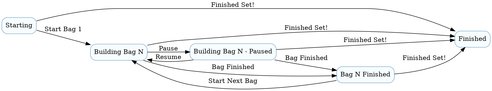

# Brick Timer UX Brief

This brief is the screen-first companion to [DESIGN.md](DESIGN.md). It focuses on the visual language, layout, and interaction details that we want to iterate on before coding.

## Product Feel

Brick Timer should feel like a precise workshop tool, not a hobby catalog or a toy app. The interface should be bold, calm, and easy to use with tired or dusty hands.

The core feeling is:

* Clear hierarchy
* Big, legible timing controls
* Minimal friction
* Useful at a glance
* Friendly, but not playful

## Design Principles

1. Make the current action obvious.
2. Keep the active build visible at all times.
3. Favor one strong primary action over many equal buttons.
4. Treat sync and errors as status, not as interruptions.
5. Use visual weight to reduce reading effort.

## Visual Direction

The preferred direction is a warm workshop theme with strong contrast:

* Backgrounds: charcoal, stone, and soft warm neutrals
* Primary accent: playful primary colors inspired by LEGO energy, but not a direct LEGO red/yellow copy
* Secondary accent: muted amber or lime for status states
* Surfaces: rounded cards with subtle elevation, not flat panels
* Typography: a sturdy, highly legible sans-serif with large numeric display treatment for the timer

The app should not look like a generic dashboard or a minimalist finance app. It should feel tactile and practical.

## Information Architecture

The app is centered around three screens:

1. Dashboard
2. Search
3. Active Build

The dashboard is the entry point. Search starts a new build. Active Build is where most of the time is spent.

## Screen Concepts

### 1. Dashboard

Purpose: show what is active, what is waiting, and what needs attention.

Main content:

* A dominant summary card for the current in-progress build
* A sync status banner or card that can become an action when items are pending
* A compact list of recent completed builds or recent sessions
* A clear primary button for starting a new build

Suggested layout:

```text
┌──────────────────────────────────────┐
│ Brick Timer                  Sync ●  │
│                                      │
│ Current build                         │
│ [ Large status card ]                 │
│  Set name                             │
│  Bag 3 of 8                           │
│  01:42:19                             │
│                                      │
│ [ Sync pending: 2 bags  Retry now ]   │
│                                      │
│ Recent builds                         │
│ [ list of completed sessions ]        │
│                                      │
│                   (+) New Build       │
└──────────────────────────────────────┘
```

Behavior notes:

* The primary action should be visually dominant.
* Sync state should read like status first, action second.
* If there is an active build, it should be impossible to miss.

### 2. Search

Purpose: find a LEGO set quickly and begin tracking.

Main content:

* Large search field at the top
* Recent searches or suggested sets when the query is empty
* Search results as cards or dense list rows with thumbnail, set number, title, and piece count
* A loading state that feels responsive, not jittery

Suggested layout:

```text
┌──────────────────────────────────────┐
│ Search sets                          │
│ [ Search by set number or name     ] │
│                                      │
│ Recent / suggested                   │
│ [ card ] [ card ] [ card ]           │
│                                      │
│ Results                              │
│ ┌──────────────────────────────────┐  │
│ │ thumbnail  42110 Land Rover     │  │
│ │            2,573 pieces         │  │
│ └──────────────────────────────────┘  │
└──────────────────────────────────────┘
```

Behavior notes:

* Debounce should be invisible to the user.
* Results should be easy to scan vertically.
* Tapping a result should start the local session setup immediately.

### 3. Active Build

Purpose: make time tracking readable from across a room.

Main content:

* Large set image or hero panel at the top
* Extremely prominent stopwatch
* Bag progress indicator
* A control dock with large contextual actions

Suggested layout:

```text
┌──────────────────────────────────────┐
│  [ set image / hero panel ]          │
│                                      │
│  01:42:19                            │
│  Bag 3                               │
│  Running                             │
│                                      │
│  ▓▓▓▓▓▓░░░░  3 of 8 bags             │
│                                      │
│ [ Pause ]   [ Complete Bag ]         │
└──────────────────────────────────────┘
```

Behavior notes:

* The current state must be obvious without reading instructions.
* The top card color and title chip color change by state.
* Use consistent state language:
	* Starting
	* Building Bag N
	* Building Bag N - Paused
	* Bag N Finished
	* Finished
* The quick action row should always include:
	* Start Next Bag
	* Bag Finished
	* Pause or Resume (single toggle button)
* A right-aligned action should end the whole set: Finished Set!
* Duration is total elapsed time for the whole set, not only the current bag.
* Current bag can be shown as Bag X of N, or Bag X of ? when total bag count is unknown.
* Controls should stay within thumb reach on phones.

Multi-set behavior:

* The dashboard may show more than one active set.
* Any active card can become the control focus when the user taps an action.
* One focused timer context is active at a time, but multiple set sessions may remain open.

State transitions (DOT):



## State Design

Each screen needs explicit loading, empty, offline, and error states.

* Loading should show structure, not a blank canvas.
* Empty states should explain the next action.
* Offline states should preserve trust and offer retry.
* Errors should be short, plain, and recoverable.

## Motion and Feedback

Motion should support understanding, not decoration.

Recommended behaviors:

* Subtle transitions between screen states
* A gentle emphasis on the active timer when running
* Clear pressed and disabled states on all actions
* Small confirmation feedback when a bag completes or sync succeeds

Avoid noisy animations, bouncing icons, or motion that distracts from the timer.

## Component Inventory

The first UI pass should likely need these reusable pieces:

* Dashboard summary card
* Sync status card or banner
* Build session row
* Search result card
* Hero image panel
* Stopwatch display
* Bag progress indicator
* Contextual action button group

## Copy Tone

Copy should be short, direct, and operational.

Examples:

* Start build
* Pause
* Resume
* Complete bag
* Sync pending
* Retry sync

Avoid verbose helper text except when the user is blocked.

## Iteration Goal

The first visual pass should answer these questions:

* Can the user see what to do in under two seconds?
* Can the user start or resume without hunting for controls?
* Does the app feel good at arm's length?
* Does the sync state feel like part of the system, not a warning box?

If those are answered well, we can move from this brief to wireframes and then to Flutter implementation.